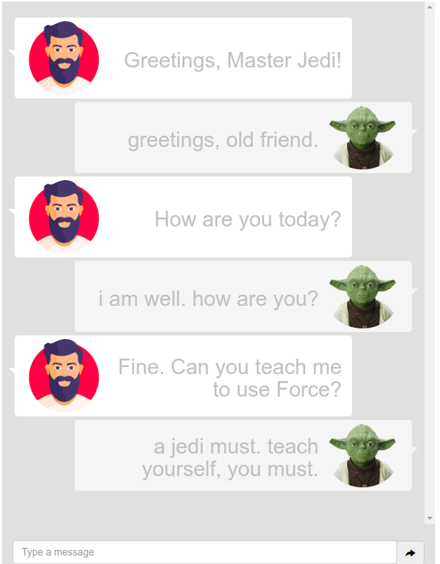
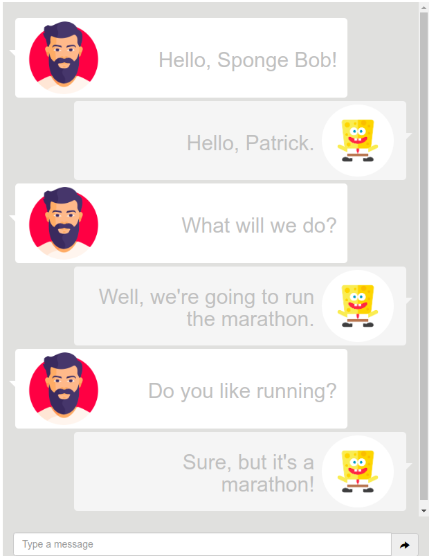

## Conversational AI Chatbot with Transfer Learning

#### **What is this?**
This is a FastAPI web application, that allows user to interact with different chatbots models (GPT, GPT2, etc). User can select model and it's personality (Yoda or SpongeBob).

Code was inspired by "[Develop a Conversational Bot in 4 simple steps](https://towardsdatascience.com/develop-a-conversational-ai-bot-in-4-simple-steps-1b57e98372e2)" that explains how to create a ChatBot using PyTorch transformers, FastAPI and Docker

#### **What is included here?**

* `app/main.py`: Main app file and docker entrypoint. This defines the FastAPI logic;
* `app/model.py`: Utility file that defines the model's logic;
* `app/static/`: Contains the icons and CSS files
* `app/templates/`: Contains the `index.html` template file that will be modified at run time with the dialog HTML using jinja
* `app/dataset/`: Data used for training Yoda and Sponge Bob personalities
* `app/gpt_models/`: Contains all files for inferencing and fine-tuning small GPT ang GPT-2 models.
* `app/pytorch_models/`: Contains all files for inferencing and fine-tuning Pytorch RNN models.
* `app/simple_TFIDF_models/`: Contains all files for inferencing simple statistical model.
* `requirements.txt`: File that contains all dependencies to install.

#### **How to run?**
1. Clone the repository to your local machine.
2. ```pip install -r requirements.txt```.
3. Setup each model as described in the corresponding README.md file in ```app/gpt_models/```, ```app/pytorch_models/``` and ```app/simple_TFIDF_models/```.
4. ```cd ../../../app```
5. ```python3 main.py```

#### **User guide**
1. In the first page you can select model and character. After pressing ```Start chat``` you will be redirected to the chat page.
2. In this page you can chat with selected character about everything. Below you can see example of chats.





3. In chat page the is also a ```Go back``` button. After pressing it you will return to the first page.